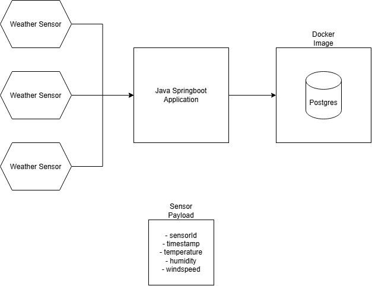

# README

Weather App Spec

## How to run:

- Install Java 21
- Install docker
- Open project in terminal
    - Run `.\mvnw.cmd spring-boot:run` (assuming windows)
- DB will be visible through the config in `compose.yaml` and whatever port your docker is running it on
- API endpoints will be available through `localhost:8080/`

## HTTP Endpoints

POST `api/v1/weather`

Expected payload (in request body)
```
{
    "sensorId": String,
    "time": String (ISO-8601),
    "temperature": String (max three digits and one decimal point, e.g. "20.0"),
    "humidity": String (max three digits and one decimal point, e.g. "45.5"),
    "windspeed": String (max three digits and one decimal point, e.g. "13.3")
}
```
---

GET `api/v1/weather`

Use query parameters to search what you are looking for.
Available parameters are:

`?sensorId=xxx` - REQUIRED \
`?time` - OPTIONAL, must be ISO-8601 format \
`?metric` - OPTIONAL \
`?stat` - OPTIONAL
- metric options = "temperature", "humidity", "windspeed" 
- stat options = "min", "max", "avg" 

Behaviours:

- API will only return one response per sensor (i.e. if there are multiple records from the same sensor - the API will only return the most recent record)
- You can request multiple sensors

- Get all metrics by leaving unspecified
    - Or get one metric by specifying

- Default stat is average
    - Must specify min and max where desired

Example requests:

Example 1:
`localhost:8080/api/v1/weather?sensorId=sensor-1` \
Example 2:
`localhost:8080/api/v1/weather?sensorId=sensor-1&sensorId=sensor-2` \
Example 3:
`localhost:8080/api/v1/weather?sensorId=sensor-1&startTime=1970-01-01T00:00:00.000Z&endTime=1970-02-01T00:00:00.000Z&metric=temperature&stat=max` 

## Architecture



## Further Developments

- Rate limiting / data retrival limit
- Stronger input validation / sanitization 
- More detailed testing
- Request specifically 2 metrics
- authentication / authorization

## AI Prompts

Below is a sumary of the AI prompts I have used to create this project. \
Admittedly I was not shy to use AI-assistance for this project, my reasoning being that a lot of the code required felt quite standard and it was easier to explain and let it create than manually type out certain parts of this project. \
I hope this readme provides evidence that I understand the code I am presenting to you and I look forward to meeting with yous to discuss this project further

```

3 September 2026: Weather API Creation

- The project evolved into a PostgreSQL-backed Spring Boot weather API.

Implemented
- POST /api/v1/weather
- Accepts sensorId, time, temperature, and humidity.

- GET /api/v1/weather
- Returns the latest reading when no time filter is provided.
- Supports exact time queries.
- Supports startTime and endTime ranges.
- Added Spring Data JPA and PostgreSQL dependencies.
- Converted WeatherReading into a JPA entity.
- Added WeatherRepository with time-based query methods.
- Replaced the in-memory store with database persistence.
- Added schema.sql to create the weather_readings table and an index on sensor/time.
- Added WeatherRequest DTO validation:
- Required sensor ID, timestamp, temperature, and humidity.
- Timestamp must not be in the future.
- Added integration tests and an H2 test configuration.

4 September 2026: Expand the weather query API

- Support one, multiple, or all sensorId values.
- Replace exact time filtering with optional startTime and endTime.
- Add metric=temperature|humidity.
- Add stat=min|max|avg, defaulting to avg.
- Update the controller, service, repository, and integration tests.

6 September 2026: Diagnose windspeed persistence

- You first asked why PostgreSQL reported that the windspeed column did not exist.
- You then asked why windspeed was still stored as 0.0.
- The cause was identified as both an outdated database schema and an incorrect setWindspeed setter in WeatherRequest.java.

6 September 2026: Design error handling

- You asked for the most elegant error-handling approach for the current system.
- The recommendation was a global @RestControllerAdvice using Spring’s ProblemDetail, with controllers handling HTTP concerns and - services throwing meaningful domain exceptions.
```